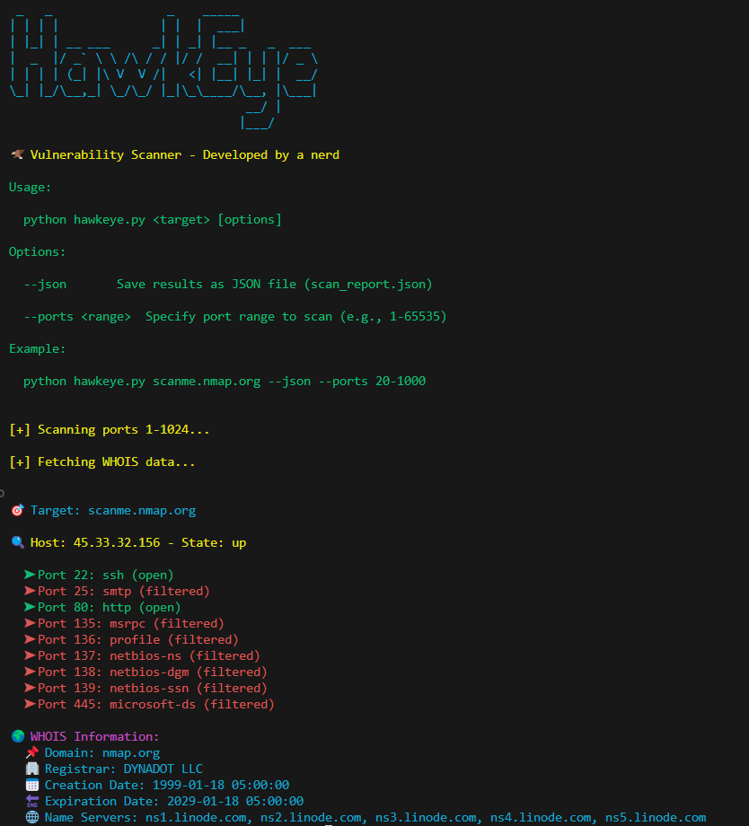

# 🦅 HawkEye - Vulnerability Scanner

HawkEye is a powerful and easy-to-use **port scanner & WHOIS information aggregator**, designed for cybersecurity enthusiasts, penetration testers, and network administrators. With its intuitive CLI and customizable scanning options, HawkEye provides detailed insights into open ports and domain information.

## 🚀 Features

✅ **Fast & Efficient Port Scanning** – Uses `nmap` to detect open/filtered ports.  
✅ **Customizable Port Ranges** – Scan specific ranges (`--ports 20-1000`) or full (`1-65535`).  
✅ **WHOIS Lookup** – Fetches **domain registrar, creation/expiration dates, and name servers**.  
✅ **Real-time Terminal Output** – Stylized, color-coded results with emojis.  
✅ **JSON Export** – Save scan results using the `--json` flag.

## 🔥 Usage

Run HawkEye with a target IP or domain:
```bash
python hawkeye.py <target>
```

### Examples:

Scan a domain with default ports (`1-1024`):
```bash
python hawkeye.py scanme.nmap.org
```

Scan an IP with a **custom port range**:
```bash
python hawkeye.py 127.0.0.1 --ports 20-1000
```

Save results as **JSON**:
```bash
python hawkeye.py scanme.nmap.org --json
```

## 🛠 Installation

1. Clone the repository:
   ```bash
   git clone https://github.com/PhasmeHargneux/HawkEye.git
   cd HawkEye
   ```
2. Install required dependencies:
   ```bash
   pip install -r requirements.txt
   ```
3. Run the scanner using Python:
   ```bash
   python hawkeye.py <target>
   ```

## 🎨 Terminal Preview



## ⚠️ Disclaimer

HawkEye is intended for **educational and authorized security testing purposes only**. Ensure you have **permission** before scanning any external systems. Unauthorized scanning may be **illegal**.

## 📜 License

This project is licensed under the MIT License - see the [LICENSE](LICENSE) file for details.

## 🤝 Contributing

Contributions are welcome! Feel free to fork this repository and submit a pull request with any improvements or new features.

## 📬 Contact

💡 Found a bug or have a feature request? Open an [issue](https://github.com/PhasmeHargneux/HawkEye/issues) on GitHub.

🔗 **GitHub**: [HawkEye Repo](https://github.com/PhasmeHargneux/HawkEye)

🔥 **Hope my tool will help you !** 🚀
